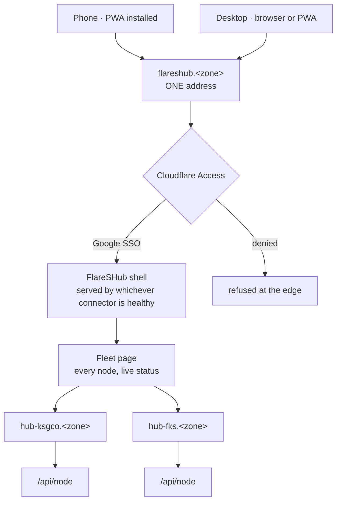
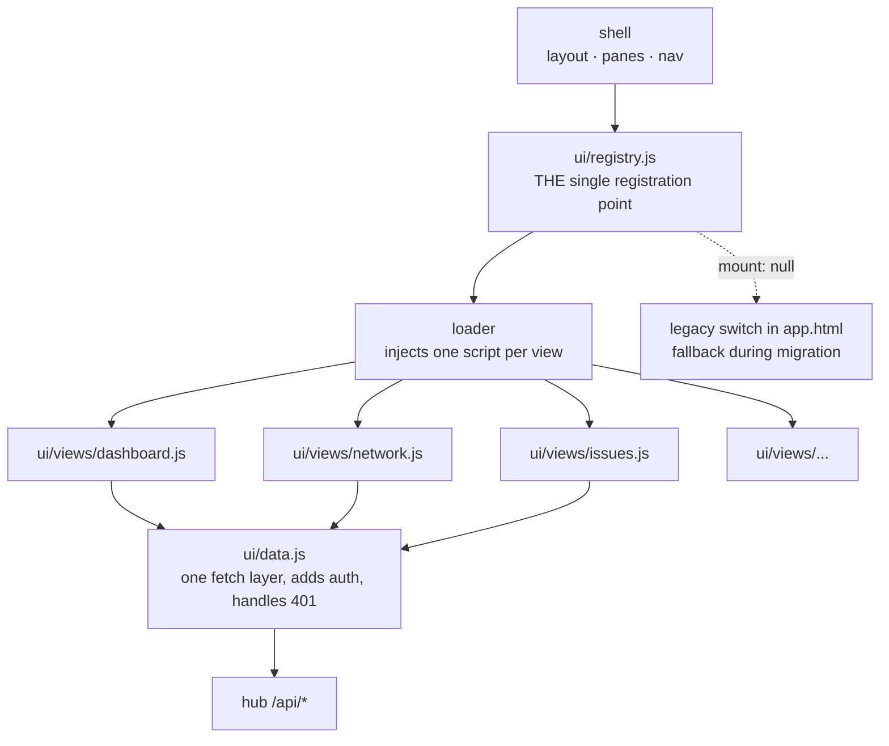
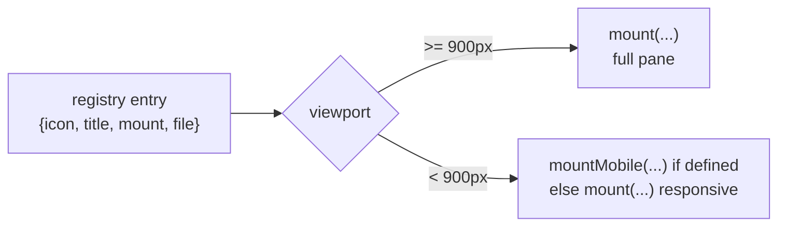
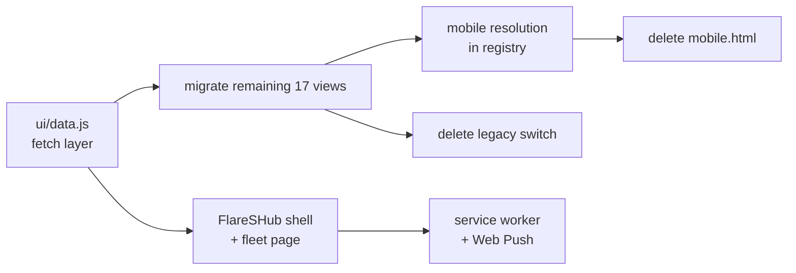

# FlareSHub — Frontend DAG

How one app reaches any server, on any device, without a monolith.

Companion to `flareshub-blueprint.md`. Diagrams render on GitHub.

---

## 1. Entry — one app, one address, either device



**One address, not one machine.** The same tunnel runs a connector on every
node, so Cloudflare serves the app from whichever is healthy. Lose a server and
the entry point survives — which is exactly what did not happen when
fks-services went down.

**Mobile and desktop enter identically.** No separate mobile URL, no separate
app. The device changes the layout, never the entry.

---

## 2. Why the current frontend is a monolith

```
app.html      6,518 lines   ← desktop, one file, 5,234 lines of inline JS
mobile.html     771 lines   ← a SECOND frontend, separately maintained
```

Two codebases for one product. A fix applied to one silently misses the other.
That is the duplication to delete, not tidy.

Changing one view used to mean editing four places — `VIEW_DEFS`, the
`mountPaneContent` switch, `openView`, `buildCmdIndex` — and they had already
drifted: `survey` has a render case and no metadata entry, `_browser_old` is
dead code nothing routes to.

---

## 3. Target — registry-driven, one file per view



**Adding a view = one file + one registry entry.** `app.html` is never touched
again — the loader injects the script tag. That rule is already enforced.

**Each view is independently reversible.** `mount: null` and it renders from the
legacy switch exactly as before. Which is why the switch stays until every view
has moved, and not one commit longer.

---

## 4. Mobile and desktop resolve in the registry, not in a second file



A view declares one mount. If it genuinely needs a different shape on a phone —
a table becoming cards — it declares `mountMobile` **in the same file**. Layout
differences live beside the view they belong to, never in a parallel frontend.

That is what kills `mobile.html`: nothing is duplicated, so there is nothing to
keep in sync.

---

## 5. The non-monolithic rules

1. **No view logic in `app.html`.** It is a shell: layout, panes, nav. Nothing else.
2. **One file per view** in `ui/views/`, named for its registry key.
3. **The registry is the only registration point.** Not four places. One.
4. **Views never call `fetch` directly** — they go through `ui/data.js`, so auth
   headers and 401 handling exist once. (fksinv has this right already:
   `lib/services.js` injects the session header; its dashboard uses it.)
5. **Views never import each other.** Same rule that fixed the backend, where
   handlers importing `server.py` back made the split cosmetic.
6. **No second frontend.** Device differences are layout, declared in the view.

**The test:** delete any one file in `ui/views/` and only that view breaks. If
something else does, it was not modular.

---

## 6. Where this actually is

| | |
|---|---|
| `/ui/` static route, traversal-guarded | ✅ built |
| `ui/registry.js` — 19 views, loader | ✅ built |
| Flip switch in `mountPaneContent` | ✅ built |
| Views migrated | **2 of 19** (`issues`, `browser`) |
| `ui/data.js` fetch layer | ❌ not built |
| Mobile resolution in registry | ❌ not built |
| `mobile.html` retired | ❌ still a second frontend |
| FlareSHub shell + fleet page | ❌ not built |

Verified live on ksgcohub: registry loads, 19 views, 2 with mounts, 17 falling
through to the legacy switch, no console errors.

---

## 7. Order



`ui/data.js` comes first because every migrated view should be written against
it rather than retrofitted. `mobile.html` cannot be deleted until mobile
resolution exists, and the legacy switch cannot go until all 17 views have
moved — both are load-bearing until then.

---

## 8. Why this shape

The backend went through exactly this. `server.py` was 2,890 lines and the
handler split was cosmetic until the dependency cycle was broken — handlers were
importing `server.py` back 22 times, so nothing could actually be moved or
deleted independently. Once the flow went one way, `server.py` fell to 122 lines.

The frontend is at the same stage the backend was: files created, structure
announced, dependencies still tangled. Rules 4 and 5 are what stop it landing in
the same place.
