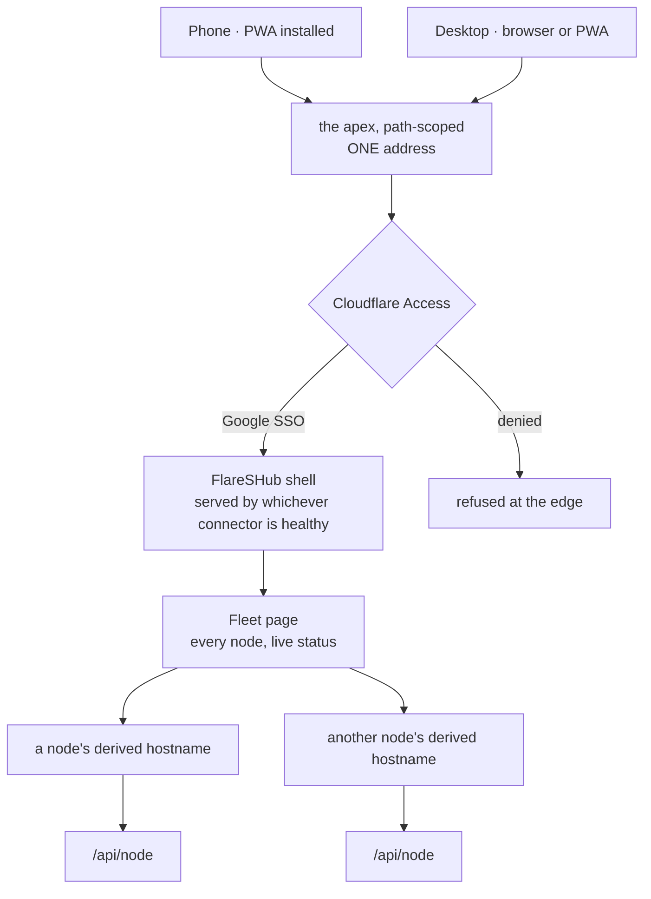
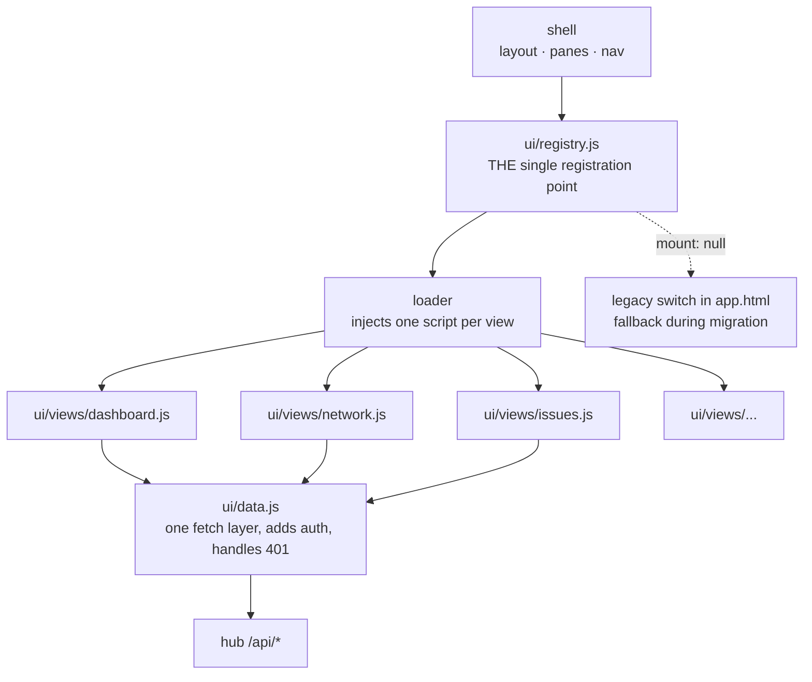
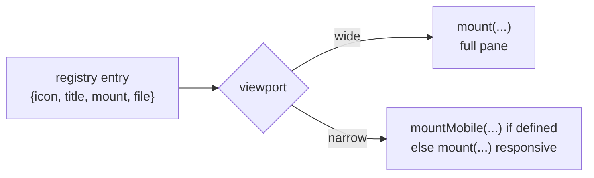
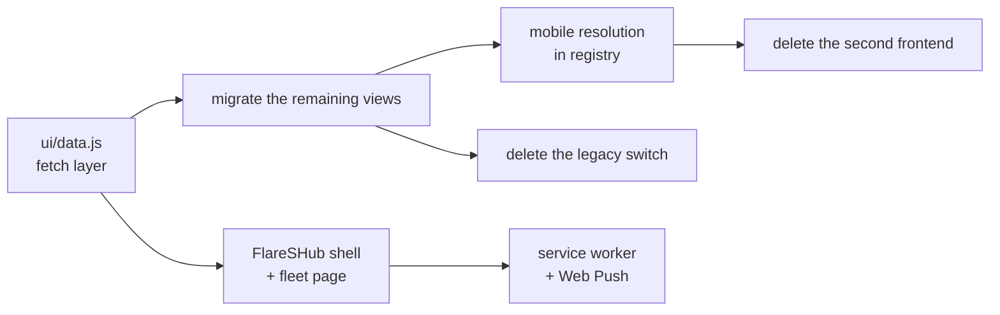

# FlareSHub — Frontend DAG

How one app reaches any server, on any device, without a monolith.

Companion to `flareshub-blueprint.md` and `flareshub-doctrine.md`. Diagrams
render on GitHub.

> **No status marks here.** This page previously carried a "where this actually
> is" table. It claimed the FlareSHub shell and the fleet page were *not built*
> while both were live and load-bearing, and it named two hostnames that are not
> ours — one of them `hub-ksgco`, the typo that became permanent DNS pointing at
> a tunnel nothing runs. Ask instead:
>
> ```bash
> python3 hub/tools/atlas.py        # which planes exist, and which were typed
> python3 hub/tools/check-views.py  # registry and renderer, both directions
> python3 hub/tools/situation.py    # what is serving and what is exposed
> curl -s <hub>/api/sitemap         # the route table, generated from itself
> ```

---

## 1. Entry — one app, one address, either device


```mermaid
flowchart TD
    M[Phone · PWA installed] --> E
    D[Desktop · browser or PWA] --> E
    E["the apex, path-scoped<br/>ONE address"] --> A{Cloudflare Access}
    A -->|Google SSO| S
    A -->|denied| X[refused at the edge]
    S["FlareSHub shell<br/>served by whichever connector is healthy"] --> F[Fleet page<br/>every node, live status]
    F --> N1["a node's derived hostname"]
    F --> N2["another node's derived hostname"]
    N1 --> API1["/api/node"]
    N2 --> API2["/api/node"]
```

**One address, not one machine.** The same tunnel runs a connector on every
node, so Cloudflare serves the app from whichever is healthy. Lose a server and
the entry point survives — which is exactly what did not happen when a node went
down.

**Mobile and desktop enter identically.** No separate mobile URL, no separate
app. The device changes the layout, never the entry.

**No hostname is written on this page, deliberately.** A node's hostname is
derived from its `machine_id`, never typed — *"a name a human types is a name a
human gets wrong."* Print the real ones:

```bash
python3 hub/tools/situation.py
python3 hub/tools/cf-check.py     # the zone's records, read-only
```

Names that are **not ours** and must never be altered or tidied:
`dashboard.flarevault.dev` and the apex landing page, which belong to
FlareVault; anything under another project's zone.

---

## 2. Why the first frontend was a monolith

Two frontends, separately maintained, for one product: a large single-file
desktop app and a second, smaller mobile file sharing none of its CSS, registry
or JS. A fix applied to one silently missed the other. That is the duplication
to delete, not tidy.

Changing one view used to mean editing four places — `VIEW_DEFS`, the
`mountPaneContent` switch, `openView`, `buildCmdIndex` — and they had already
drifted: a view with a render case and no metadata entry, and dead code nothing
routed to. `hub/tools/check-views.py` exists to fail on exactly that, in both
directions.

Line counts are not recorded here. `wc -l hub/app.html hub/mobile.html` if you
need them; they were wrong in this file twice.

---

## 3. Target — registry-driven, one file per view


```mermaid
flowchart TD
    SH[shell<br/>layout · panes · nav] --> R["ui/registry.js<br/>THE single registration point"]
    R --> L[loader<br/>injects one script per view]
    L --> V1[ui/views/dashboard.js]
    L --> V2[ui/views/network.js]
    L --> V3[ui/views/issues.js]
    L --> V4[ui/views/...]
    V1 --> DATA
    V2 --> DATA
    V3 --> DATA
    DATA["ui/data.js<br/>one fetch layer, adds auth, handles 401"] --> HUB["hub /api/*"]
    R -.->|"mount: null"| LEG[legacy switch in app.html<br/>fallback during migration]
```

**Adding a view = one file + one registry entry.** `app.html` is never touched
again — the loader injects the script tag. That rule is enforced by
`check-views.py`, not by anyone remembering it.

**Each view is independently reversible.** `mount: null` and it renders from the
legacy switch exactly as before. Which is why the switch stays until every view
has moved, and not one commit longer.

---

## 4. Mobile and desktop resolve in the registry, not in a second file


```mermaid
flowchart LR
    REG["registry entry<br/>{icon, title, mount, file}"] --> Q{viewport}
    Q -->|"wide"| DV["mount(...)<br/>full pane"]
    Q -->|"narrow"| MV["mountMobile(...) if defined<br/>else mount(...) responsive"]
```

A view declares one mount. If it genuinely needs a different shape on a phone —
a table becoming cards — it declares `mountMobile` **in the same file**. Layout
differences live beside the view they belong to, never in a parallel frontend.

That is what kills the second frontend: nothing is duplicated, so there is
nothing to keep in sync.

---

## 5. The non-monolithic rules

1. **No view logic in `app.html`.** It is a shell: layout, panes, nav. Nothing else.
2. **One file per view** in `ui/views/`, named for its registry key.
3. **The registry is the only registration point.** Not four places. One.
4. **Views never call `fetch` directly** — they go through `ui/data.js`, so auth
   headers and 401 handling exist once.
5. **Views never import each other.** Same rule that fixed the backend, where
   handlers importing `server.py` back made the split cosmetic.
6. **No second frontend.** Device differences are layout, declared in the view.

**The test:** delete any one file in `ui/views/` and only that view breaks. If
something else does, it was not modular.

---

## 6. Order, and why it is this order


```mermaid
flowchart LR
    A["ui/data.js<br/>fetch layer"] --> B[migrate the remaining views]
    B --> C[mobile resolution<br/>in registry]
    C --> D[delete the second frontend]
    B --> E[delete the legacy switch]
    A --> F[FlareSHub shell<br/>+ fleet page]
    F --> G[service worker<br/>+ Web Push]
```

`ui/data.js` comes first because every migrated view should be written against
it rather than retrofitted. The second frontend cannot be deleted until mobile
resolution exists, and the legacy switch cannot go until every view has moved —
both are load-bearing until then.

Which of these has landed is not written here. `python3 hub/tools/tracks.py`
enforces the order and names what is next; `python3 hub/tools/step.py` names the
current step.

---

## 7. Why this shape

The backend went through exactly this. The handler split was cosmetic until the
dependency cycle was broken — handlers were importing `server.py` back, so
nothing could actually be moved or deleted independently. Once the flow went one
way, `server.py` collapsed to a bootstrap.

The frontend is at the same stage the backend was: files created, structure
announced, dependencies still tangled. Rules 4 and 5 are what stop it landing in
the same place.
